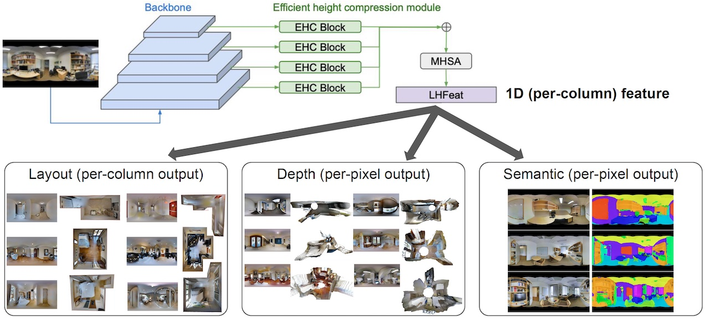

# HoHoNet

This is the implementation of our CVPR'21 "[HoHoNet: 360 Indoor Holistic Understanding with Latent Horizontal Features
](https://arxiv.org/abs/2011.11498)".



#### News
- April 3, 2021: Release inference code, jupyter notebook and visualization tools. Guide for reproduction is also finished.
- March 4, 2021: A new backbone **[HarDNet](https://github.com/PingoLH/Pytorch-HarDNet)** is included, which shows better speed and depth accuracy.


## Pretrained weight
Links to trained weights `ckpt/`: [download on Google drive](https://drive.google.com/drive/folders/1raT3vRXnQXRAQuYq36dE-93xFc_hgkTQ?usp=sharing) or [download on Dropbox](https://www.dropbox.com/sh/b014nop5jrehpoq/AACWNTMMHEAbaKOO1drqGio4a?dl=0).


## Inference
### Jupyter notebook
See [infer_depth.ipynb](infer_depth.ipynb), [infer_layout.ipynb](infer_layout.ipynb), and [infer_sem.ipynb](infer_sem.ipynb) for interactive demo and visualization.

### Batch inference
Run `infer_depth.py`/`infer_layout.py` to inference depth/layout.
Use `--cfg` and `--pth` to specify the path to config file and pretrained weight.
Specify input path with `--inp`. Glob pattern for a batch of files is avaiable.
The results are stored into `--out` directory with the same filename with extention set ot `.depth.png` and `.layout.txt`.

Example for depth:
```
python infer_depth.py --cfg config/mp3d_depth/HOHO_depth_dct_efficienthc_TransEn1_hardnet.yaml --pth ckpt/mp3d_depth_HOHO_depth_dct_efficienthc_TransEn1_hardnet/ep60.pth --out assets/ --inp assets/pano_asmasuxybohhcj.png
```

Example for layout:
```
python infer_layout.py --cfg config/mp3d_layout/HOHO_layout_aug_efficienthc_Transen1_resnet34.yaml --pth ckpt/mp3d_layout_HOHO_layout_aug_efficienthc_Transen1_resnet34/ep300.pth --out assets/ --inp assets/pano_asmasuxybohhcj.png
```

### Visualization tools
To visualize layout as 3D mesh, run:
```
python vis_layout.py --img assets/pano_asmasuxybohhcj.png --layout assets/pano_asmasuxybohhcj.layout.txt
```
Rendering options: `--show_ceiling`, `--ignore_floor`, `--ignore_wall`, `--ignore_wireframe` are available.
Set `--out` to export the mesh to `ply` file.
Set `--no_vis` to disable the visualization.
<p align="center">
    
</p>


To visualize depth as point cloud, run:
```
python vis_depth.py --img assets/pano_asmasuxybohhcj.png --depth assets/pano_asmasuxybohhcj.depth.png
```
Rendering options: `--crop_ratio`, `--crop_z_above`.
<p align="center">
    
</p>


## Reproduction
Please see [README_reproduction.md](README_reproduction.md) for the guide to:
1. prepare the datasets for each task in our paper
2. reproduce the training for each task
3. reproduce the numerical results in our paper with the provided pretrained weights


## Citation
Released after CVPR 2021.
